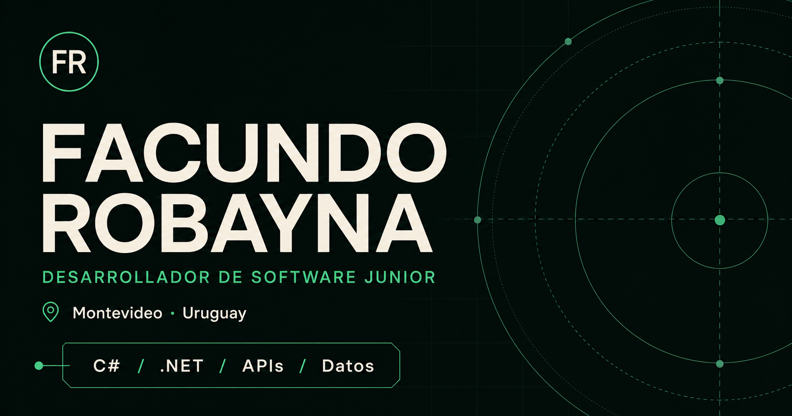

# Portfolio de Facundo Robayna

Portfolio personal desarrollado para presentar mi perfil como estudiante de
Tecnologías de la Información y Desarrollador de Software Junior.

**Sitio publicado:** [fakudll.github.io](https://fakudll.github.io/)



## El producto

El sitio reúne mi presentación profesional, tecnologías, proyectos, experiencia,
datos de contacto y CV en una sola página.

Busqué una experiencia oscura, minimalista y técnica, inspirada visualmente en
[mxb.dev](https://mxb.dev/) sin copiar su código, contenido ni identidad. El
diseño fue construido desde cero y se adapta a escritorio y dispositivos
móviles.

## Desarrollo

El portfolio fue desarrollado con React, TypeScript, Vinext, Vite y CSS propio.
Combina contenido renderizado en el servidor con pequeños componentes cliente
para las interacciones de contacto.

Incluye:

- Navegación responsive entre secciones.
- Presentación de proyectos y tecnologías.
- Copia directa del email sin depender de una aplicación de correo.
- Descarga del CV en PDF.
- Navegación por teclado y soporte para `prefers-reduced-motion`.
- Metadata social, sitemap y optimización para buscadores.

El sitio se valida con ESLint y pruebas automáticas antes de generar la versión
estática que se publica mediante GitHub Actions y GitHub Pages.

## Ejecutar localmente

```bash
git clone https://github.com/FakuDLL/FakuDLL.github.io.git
cd FakuDLL.github.io
npm install
npm run dev
```

Requiere Node.js 22.13 o superior.

## Autor

**Facundo Robayna**

- [GitHub](https://github.com/FakuDLL)
- [LinkedIn](https://www.linkedin.com/in/facundo-robayna-6612a7290/)
